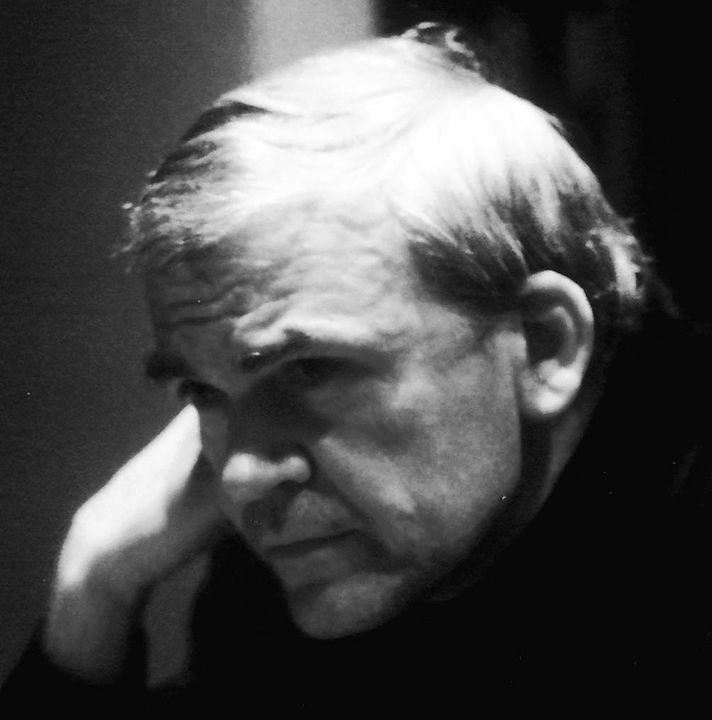

```{r setup, include=FALSE}
knitr::opts_chunk$set(echo = TRUE)
library(blogdown)
```

## Milan Kundera

```{r}
#| echo: false
#| fig.cap: "Milan Kundera"
#| fig.align: "center"
#| out.width: "40%"
#| out.height: "40%"


```


## Story

We will read this terrifying story by this great Writer, titled **The Hitchhiking Game**.]



## Themes

-   Young Love
-   Games and Teasing
-   Rules in the Game
-   Ego and Pain
-   Consent

## Notes and References

### Additional Material

## Song for the Story

Song: Chalo Ek Baar Phir Se\
Album: Gumrah\
Year: 1963

Artist: Mahendra Kapoor\
Director: B.R.Chopra\
Star Cast: Sunil Dutt, Mala Sinha, Ashok Kumar, Shashikala, Nirupa Roy, Nana Palsekar\
Music Director: Ravi\
Lyricist: Sahir Ludhianvi

::: {#fig-chalo}
<center>

</center>
Mahendra Kapoor singing "Chalo Ek Baar Phir Se" from the movie "Gumrah" (1963)
:::


::: {style="text-align: center; font-size: 0.75em;"}

| Hindi (and quite some Urdu!) Lyrics                           | English Translation                                                        |
|----|-----|
| ***chalo ek baar phir se, ajnabii ban jaayein ham donon(2)*** | Come, let us become strangers once again                                   |
| -----                                                         | -----                                                                      |
| ***na main tumse koi ummiid rakhuun dil-navaazii kii***       | I shall no longer maintain hopes of compassion from you                    |
| ***na tum merii taraf dekho ghalat andaaz nazaron se***       | Nor shall you gaze at me with your deceptive glances.                      |
| ***na mere dil ki dhaDkan laDkhaDaaye merii baaton mein***    | My heart shall no longer tremble when I speak,                             |
| ***na zaahir ho tumhaari kashm-kash ka raaz nazaron se***.    | Nor shall your glances reveal the secret of your torment.                  |
| ----                                                          | ----                                                                       |
| ***tumhein bhii koii uljhan roktii hai pesh-qadmii se***      | Complications prevent you from advancing further,                          |
| ***mujhe bhii log kahte hain ki yeh jalve paraaye hain***     | I too am told that I wear disguises.                                       |
| ***mere hamraah bhi rusvaayiaan hain mere maazii kii***       | The disgraces of my past are now my companions,                            |
| ***tumhaare saath bhii guzrii huii raaton ke saaye hain***    | while the shadows of bygone nights are with you too.                       |
| -----                                                         | -----                                                                      |
| ***taarruf rog ho jaaye to usko bhuulnaa bahtar***            | Should knowing one another become a disease, then it is best to forget it. |
| ***taalluq bojh ban jaaye to usko toDnaa achhaa***            | Should a relationship become a burden, then it is best to end it.          |
| ***voh afsaana jise anjaam tak laanaa na ho mumkin***         | For that tale which cannot culminate in a conclusion,                      |
| ***use ek khuubsuurat moD de kar chhoDna achhaa***            | it is best to give it a beautiful turn and leave it be.                    |
| -----                                                         | -----                                                                      |
| ***chalo ek baar phir se, ajnabii ban jaayein ham donon***    | Come, let us become strangers once again.                                  |

: Chalo ek baar phirse {.striped .hover}
:::

## Writing Prompts

1)  Being a conservatively brought up young person at a bar
2)  On a deep desire to commit an act of violence and how you would resist it, or not
3)  On finding hidden depths of personality on your best friend ( and how you found out)
