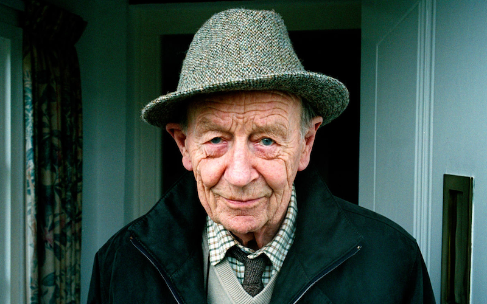

```{r setup, include=FALSE}
knitr::opts_chunk$set(echo = TRUE)
library(blogdown)
```


## Ireland: William Trevor




## Story

We will read a sombre but enlightening story by this great Writer, **A Choice of Butchers**. I will bring hardcopies to class and we will read aloud. It is also available in the collection of short stories titled *The Collected Stories* (2005). It can also be found in *You've Got to Read This: Contemporary Writers Introduce Stories That Held Them in Awe*, edited by Ron Hansen (New York, 1994).

## Additional Material

Quoted from the <u>[**LitHub Website**](https://lithub.com/)</u>

> One of his stories that has always spoken to me is “A Choice of Butchers.” Reading it again, I prepared myself in advance for the emotional impact it would have on me, only to experience its tragic force more acutely. He handles the intersection of childhood with the adult world so beautifully. To me this is a story both about the loss of innocence and, at the same time, the ongoing state of innocence that can betray us when we are young.
I cherish the dreary details of the house, the oatmeal wallpaper, the way he describes domestic spaces and habits, and people’s physical traits. And that uncommon, perfect word at the end to describe the father: “rumbustiousness.” The story is layered and ambiguous, elegiac, brilliantly understated, impossible not to read in one sitting. It articulates the terrifying resentment, disappointment, and anger we can feel towards our parents, and the confusion and distress evoked by those very feelings.

[– Jhumpa Lahiri]{style="float:right"}


## Themes

- Families
- Adults and Children
- Parents are human too
- Petty Jealousy
- Personal Folly
- "From the Mouths of Babes"

## Additional Material


### Notes and References

1. <u>[**7 Writers share their favourite William Trevor story**](https://lithub.com/7-writers-share-their-favorite-william-trevor-story/)</u>
2. Another good "Dad" story is this one by Grace Paley: <u>[**A Conversation with My Father**](../../../../materials/pdfs/AConversationWithMyFather-GracePaley.pdf)</u>


## Song for the Story

Billy Currington's Country hit from 2003, *Walk a Little Straighter*.

>"Walk a Little Straighter" was written by Billy Currington, making it a very personal composition. This song is a highly autobiographical track, inspired by Currington's own childhood experiences. The song narrates the story of a young boy addressing his father's alcohol addiction. "Walk a Little Straighter," tells about the pain and hope a child feels towards his father who is struggling with alcoholism. Upon its release in 2003, "Walk a Little Straighter" became a significant success, reaching No. 8 on the US Billboard Hot Country Songs chart. It marked the beginning of Billy Currington's successful career in country music.




Walk A Little Straighter
Billy Currington

::: {style="text-align: center; font-size: 0.75em;"}

I remember lookin' up to look up to him.\
An' I remember, most the time he wasn't there.\
I'd be waitin' at the door when he got home at night.\
He'd pass me by to go pass out in his chair.\

An' I'd say: "Walk a little straighter, Daddy,\
You're swayin', side to side.\
Your footsteps make me dizzy,\
And no matter how I try,\
I keep trippin' an' stumblin'.\
If you'd look down here, you'd see:\
Walk a little straighter, Daddy,\
You're leading me."\

He stumbled in the gym on graduation day.\
An' I couldn't help but feel so ashamed.\
An' I wasn't surprised a bit when he didn't stay,\
He stumbled out before they called my name.\

An' I thought: "Walk a little straighter, Daddy,\
You're swayin', side to side.\
It's not just me who's watching,\
You've caught everybody's eye.\
And you're trippin' an' stumblin',\
And even though I've turned eighteen,\
Walk a little straighter, Daddy,\
You're still leading me."\

The old man's still like he always was,\
But I love him anyway.\
If I've learned one thing from him,\
It's my kids will never have to say:\

"Walk a little straighter, Daddy,\
You're swayin', side to side.\
Your footsteps make me dizzy,\
And no matter how I try,\
I keep trippin' an' stumblin'.\
If you'd look down here, you'd see:\
Walk a little straighter, Daddy,\
You're leading me."\

"Yeah, walk a little straighter, Daddy,\
You're leading me."

:::

## Writing Prompts

1. When Adults goof up
1. What is "Good Parenting"?
1. Do Adults apologize to young people?
1. "ChhoTa mooh aur Badi Baat: Out of the Mouths of Babes". 
1. Compare this story with Rudyard Kipling's story, <u>[Tods' Amendment @Kipling Society](https://www.kiplingsociety.co.uk/tale/tods-amendment.htm)</u>. See notes on the <u>[same web page](https://www.kiplingsociety.co.uk/readers-guide/rg_tods1.htm)</u>.

