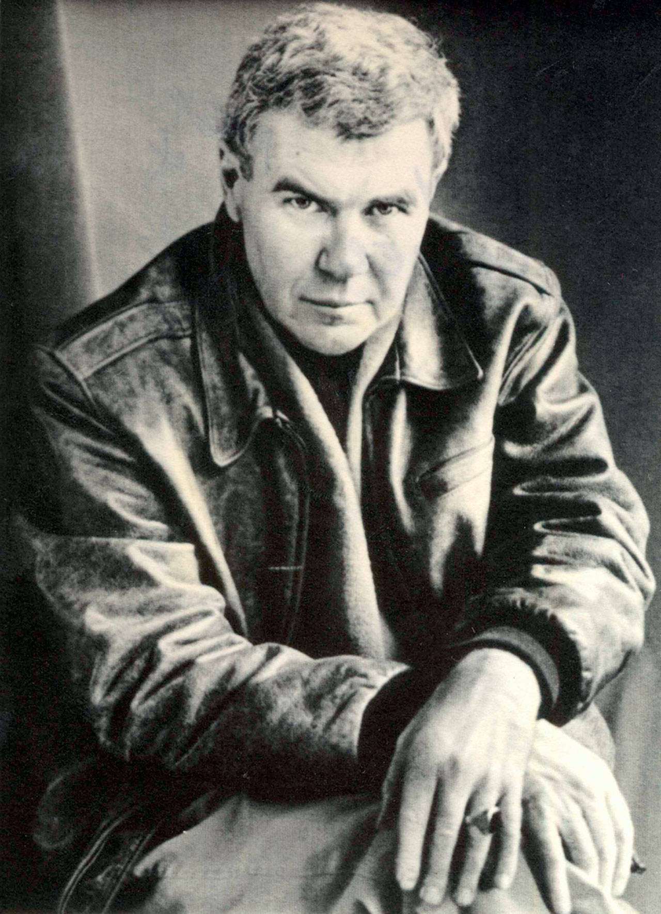
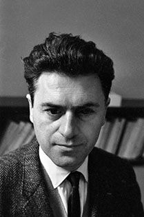

```{r setup, include=FALSE}
library(blogdown)
```

## USA: Raymond Carver

```{r}
#| echo: FALSE
#| fig-align: "center"
#| fig-cap: "Raymond Carver (1938-1988)"
#| out.width: "30%"
#| out.height: "30%"


```


## Story
We will read Carver's luminous story, **Cathedral**.



## Themes
  - Blindness
  - Jealousy
  - Irony / Miscomprehension
  - Cheerfulness of the Blind
  
## Additional Material

### Notes and References  

 1. Raymond Carver on <u>[How to Write](https://lithub.com/get-in-get-out-dont-linger-go-on-read-raymond-carvers-greatest-writing-advice/)</u>
 
1. Short Film on this story:
<br>

<br>

2. H.G. Wells' story, <u>[The Country of the Blind](/pdf/ISTW/HGWells - The Country of the Blind.docx)</u>

> "The Country of the Blind" is a short story written by H. G. Wells. It was first published in the April 1904 issue of The Strand Magazine and included in a 1911 collection of Wells's short stories, The Country of the Blind and Other Stories. It is one of Wells's best known short stories, and features prominently in literature **dealing with blindness**.  
[-Wikipedia]{style="float:right"}

<br>
4. **Sparsh**, starring Naseeruddin Shah and Shabana Azmi. 

::: {#fig-sparsh}
<center>

</center>
Sparsh
:::

> Sparsh (English: Touch) is a 1980 Indian Hindi feature film directed by Sai Paranjpye. It stars Naseeruddin Shah and Shabana Azmi playing the characters of a visually impaired principal and a sighted teacher in a school for the blind, where they fall in love though soon their complexes tag along and they struggle to get past them to reconnect with the "touch" of love. 
>
> The film remains most memorable for the subtle acting of its leads, plus the handling of the issue of relationships with the visually handicapped, revealing the emotional and perception divide between the worlds of the "blind" and the "sighted", epitomized by the characters. The film won the National Film Award for Best Feature Film in Hindi. However, the film's release was delayed by almost 4 years.

Shorter Summary:

<u><https://www.dailymotion.com/video/x3nv3l5></u>


5. *And Then there was Light* is the autobiography of Jacques Lusseyran, the blind hero of the French Resistance during WWII.

```{r}
#| echo: FALSE
#| fig-align: "center"
#| fig-cap: "Jacques Lusseyran (1924-1971)"
#| out.width: "30%"
#| out.height: "30%"



```

<u><https://angelusnews.com/news/us-world/jacques-lusseyran-blind-hero-of-the-french-resistance/></u>

> “And There Was Light” is the strange and beautiful autobiography of Jacques Lusseyran, “blind hero of the French Resistance.”
>
>Born in Paris in 1924, Lusseyran lost his sight at the age of 8 in a schoolroom incident.  Even at that age, he was groping toward the transcendent.
>
>Trying to navigate his way around a world he could no longer see, he came to learn that inanimate things are alive, and of the sympathetic current that runs between the branches of a tree in springtime, and that if you press the little stone you’ve secreted in your pocket, it will press back.
>
>He wrote, “The seeing commit a strange error. They believe that we know the world only through our eyes. For my part, I discovered that the universe consists of pressure, that every object and every living being reveals itself to us at first by a kind of quiet yet unmistakable pressure that indicates its intention and its form. I even experienced the following wonderful fact: A voice, the voice of a person, permits him to appear in a picture. When the voice of a man reaches me, I immediately perceive his figure, his rhythm, and most of his intentions.

 
### Song(s) for the Story !!

1. Mahendra Kapoor from the movie Sambandh(1969): 

::: {#fig-mahendra}
<center>

</center>
Mahendra Kapoor - Sambandh(1969)
:::

<br>

2. Deep Purple, **When a Blind Man Cries**

::: {#fig-deeppurple}
<center>

</center>
Deep Purple - When a Blind Man Cries
:::

## Writing Prompts

1. The Cheerfulness of the Blind
1. Balance of Nature: Does Nature make up for the loss of one sense by enhancing the others?
1. Are Builders 
