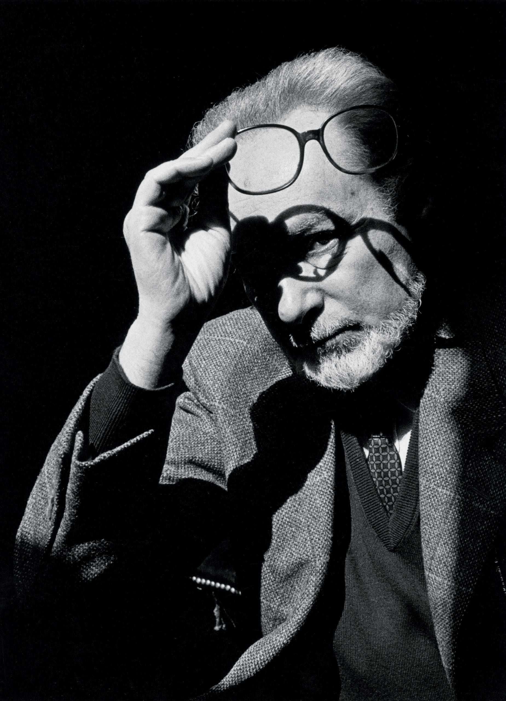

```{r setup, include=FALSE}
knitr::opts_chunk$set(echo = TRUE)
library(blogdown)
```

## Italy: Primo Levi

```{r}
#| echo: false
#| fig.cap: "Primo Levi"
#| fig-alt: "Primo Levi"
#| fig-align: "center"
#| out.width: "30%"
#| out.height: "30%"


```

> Levi, a 23-year old chemist, was arrested in December 1943 and transported to Auschwitz in February 1944. There he remained until the camp was liberated on 27 January 1945. He arrived back home in Turin in October, unrecognisable to the concierge who had seen him only a couple of years earlier.


### Story

**Hydrogen** from Primo Levi's collection *The Periodic Table*.



### Themes  

- Epiphany  
- Curiosity, the Desire to Know, and Perseverance  
- Rule Breaking  
- "Other Worldliness"  
- Metaphors: Describing an idea using vocabulary from another domain
- TRIZ, aka [Teoriya Resheniya Izobretatelskhikh Zadatch](https://arvindvenkatadri.com/slides/playandinvent/triz-basics-new/#1)


## Additional Material  

### Notes and References  

1. The last story in **The Periodic Table**, titled [**Carbon**](https://www.arvindguptatoys.com/arvindgupta/periodic-primo.pdf) is also a fantastic metaphoric journey of a single Carbon atom. Read it!! It has been described as the most accessible piece of science writing!
1. More Holocaust Reading:
    * Tadeuscz Borowski's **"Postal Indiscretions"** is a series of letters written from a concentration camp.  
    * His short story, **This Way for the Gas, Ladies and Gentlemen**  is also a harrowing read. [**Weblink to PDF**](https://www.pelister.org/courses/topics/borowski/this-way-for-gas.pdf)  
    * The World of Tadeuscz Borowski's Auschwitz <https://www.nybooks.com/daily/2021/09/12/the-world-of-tadeusz-borowskis-auschwitz/>
1. <https://www.theguardian.com/books/2017/apr/22/primo-levi-auschwitz-if-this-is-a-man-memoir-70-years>
1. A Student Reflection on Primo Levi's **Hydrogen**: <https://ocw.mit.edu/courses/literature/21l-325-small-wonders-staying-alive-spring-2007/assignments/periodic2.pdf>
1. Extract from [**“The key to the highest truths”: Primo Levi and the beauty of chemistry**](https://www.varsity.co.uk/science/19837)

  > Nonetheless, reading Levi’s writing over lockdown, I was reminded that he also witnessed chemistry’s most detestable side at Auschwitz, as part of the Chemical Kommando transporting magnesium chloride, and at the IG-Farben laboratory. Despite this, Levi never lost sight of the beauty of chemistry: for me, found in the sublimation of brilliant emerald-green crystals of nickelocene; in the jagged, imperfect trace of an action potential on the electromyograph; in the faint rainbow of lines emitted by potassium under a sodium discharge lamp. If Levi were to observe us in these practical classes, complete with our rash deductions, amateurish mistakes and shattered glassware, I like to think he would be pleased.


 
### Song for the Story !!

Song: Flying Sorcery
Artiste: Al Stewart

Alastair("Al") Ian Stewart (born 5 September 1945) is a Scottish singer-songwriter and folk-rock musician who rose to prominence as part of the British folk revival in the 1960s and 1970s. He developed a unique style of combining folk-rock songs with delicately woven tales of characters and events from history.

::: {#fig-sorcery}
<center>

</center>
Al Stewart performing "Flying Sorcery"
:::

"Flying Sorcery"
Al Stewart

::: {style="text-align: center; font-size: 0.75em;"}
With your photographs of Kitty Hawk\
And the biplanes on your wall\
You were always Amy Johnson\
From the time that you were small.\
No schoolroom kept you grounded\
While your thoughts could get away\
You were taking off in Tiger Moths\
Your wings against the brush-strokes of the day\
Are you there?\
On the tarmac with the winter in your hair\
By the empty hangar doors, you stop and stare\
Leave the oil-drums behind you, they won't care\
Oh, are you there?\

Oh, you wrapped me up in a leather coat\
And you took me for a ride\
We were drifting with the tail-wind\
When the runway came in sight\
The clouds came up to gather us\
And the cockpit turned to white\
When I looked, the sky was empty\
I suppose you never saw the landing-lights\
Are you there?\
In your jacket with the grease stain and the tear\
Caught up in the slipstream of the dare\
The compass rose will guide you anywhere,\
Oh, are you there?\

The sun comes up on Icarus as the night-birds sail away\
And lights the maps and diagrams\
That Leonardo made\
You can see Faith, Hope and Charity\
As they bank above the fields\
You can join the flying circus\
You can touch the morning air against your wheels\
Are you there?\
Do you have a thought for me that you can share?\
Oh I never thought you'd take me unawares\
Just call me if you ever need repairs\
Oh, are you there?\

:::


## Writing Prompts

1. My Genius Friend
1. What I learnt by Breaking Rules
1. Describing a Scientific Concept using everyday **objects** as metaphors.


