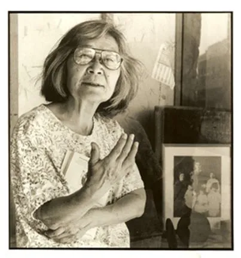

```{r setup, include=FALSE}
knitr::opts_chunk$set(echo = FALSE)
#devtools::install_github("mccarthy-m-g/embedr")
library(embedr) # Embed multimedia in HTML files
```

## Hisaye Yamamoto


```{r}
#| echo: false
#| out.height: "40%"
#| out.width: "40%"
#| fig.align: 'center'
#| fig.cap: "Hisaye Yamamoto (1921-2011)"
#| fig.alt: "A portrait of Hisaye Yamamoto"



```

</center>


From <u><https://encyclopedia.densho.org/Hisaye_Yamamoto/></u>

> A Southern California <u>[Nisei](https://encyclopedia.densho.org/Nisei/)</u>
> writer of short stories, Hisaye Yamamoto (1921–2011) was among the
> first Japanese American writers to win national renown after World War
> II. Yamamoto's upbringing in an immigrant farming community and her
> incarceration in a World War II U.S. government prison camp formed the
> basis for some of her best-known stories, notable for their sensitive
> portrayal of the emotionally and artistically constricted lives of
> <u>[Issei](https://encyclopedia.densho.org/Issei/)</u> women and
> intergenerational family dynamics. Oblique, often deadpan in delivery
> and told with quiet humor and bracing candor, they reveal the love
> affairs, madness, psychic and physical brutality that lay beneath the
> placid surface of Issei and Nisei life. The subject matter, precision
> and grace of Yamamoto's works have led critics to compare her to short
> story masters Katherine Mansfield, Flannery O'Connor, and Grace Paley.

## Story

We will read Yamamoto's story, **Seventeen
Syllables**.



## Themes

-   Inter-generational Conflict
-   Living as an Expat
-   First Love / Teenage Romance
-   Permission to Touch
-   "Arranged Marriage" (picture marriage)
-   Deception...

## Additional Material

::: {#fig-summerwind}
<center>

</center>
Hot Summer Winds(1991)
:::


### Notes and References

1.  A Beautiful Scrolly Story about Yamamoto and her influence.
    <u><https://artsandculture.google.com/story/hisaye-yamamoto-an-american-story-american-writers-museum/OAVRaqAwV3tpLA?hl=en></u>
2.  Reading Yamamoto. <u><https://faculty.georgetown.edu/bassr/heath/syllabuild/iguide/yamamoto.html></u>
3. Gangs of Wasseypur: "Permission Leni Chahiye, Na?" <u><https://youtu.be/To54dv2jnJg></u>

## Song for the Story

A song from <u>[70 years
ago](https://atulsongaday.me/2009/04/19/do-ghadi-wo-jo-paas-aa-baithe/)</u>?
For Teens!?? You must be joking!!! But just maybe it could work....so there goes!

Starring: Bharat Bhushan & Madhubala & Pradeep Kumar\
Artist: Mohammed Rafi & Lata Mangeshkar\
Lyrics: Rajendra Krishan\
Composed: Madan Mohan Kohli\
Movie/Album: Gateway Of India (1957)\

::: {#fig-gatewayofindia}
<center>

</center>
Do Ghadi Woh jo Paas aa baithe...
:::

Here is the audio track alone:

<center>
`r embedr::embed_audio("DO GHADI WOH - GATEWAY OF INDI.mp3")`
</center>

::: {style="text-align: center; font-size: 0.75em;"}

| **Hindi (and some Urdu!) lyrics**    | **English Translation**                                    |
|----------------------------------|--------------------------------------|
| *Do ghadi wo jo paas aa baithe (2)*  | *For Two Moments, when They sat beside me*                 |
| *Ham zamane se dur ja baithe(2)*     | *We were far away from everybody*                          |
| *-----*                              | *----*                                                     |
| *Bhul ki unka hamnashi ho ke (2)*    | *'Twas a mistake to share a drink*                         |
| *Royege dil ko umar bhar kho ke (2)* | *I will cry all my life for my Lost Heart*                 |
| *Haay kya chiz thi luta baithe*      | *Alas, what a Thing it was, That I have Lost...*            |
| *Do Ghadi...*                        | *Two Moments...*                                           |
| *----*                               | *----*                                                     |
| *Dil ko ek din zarur jana tha (2)*   | *The Heart had to leave One Day*                           |
| *Vahi pahucha jaha thikana tha (2)*  | *There It Reached, where it was Right*                     |
| *Dil vahi dil jo dil me ja baithe*   | *That is a Heart, that Resides in a Heart*                 |
| *Do Ghadi...*                        | *Two Moments...*                                           |
| *----*                               | *-----*                                                    |
| *Ek dil hi tha gham gusaar  (2)*     | *The Heart was my One Solace*                              |
| *meharbaan khaas raazdaar apna (2)*      | *My Patron, my Confidant...*                               |
| *ghair ka kyun use banaa baithe*     | *Why Did I Give it Away to a Stranger !!*                  |
| *Do Ghadi...*                        | *Two Moments...*                                           |
| ----                                 | ----                                                       |
| *Ghair bhi to koi haseen hogaa (2)*  | *The Stranger must also have been Lovely*               |
| *Dil yoon hi de diya nahin hoga (2)* | *You would not have parted with your Heart Just Like That* |
| *Dekhkar kuchh to chot khaa baithe*  | *You Saw Them, and were Wounded*                           |
| *Do ghadi wo jo paas aa baithe*      | *Two Moments...*                                           |
:::

## Writing Prompts

1.  Your Mama's "Arranged Marriage"
1.  A Rant in GenZ language about almost anything (please create a Glossary in an Appendix!). NO OBSCENITY PLEASE. Your grade is on the line. 
1.  Getting "(ab)used" to Dad's / Mom's taste in Music
1.  The communication between parents and child in "Seventeen Syllables" and in <u>[Grace Paley's "The Loudest Voice"](http://www.loa.org/images/pdf/Paley_Loudest_Voice.pdf)</u>.


