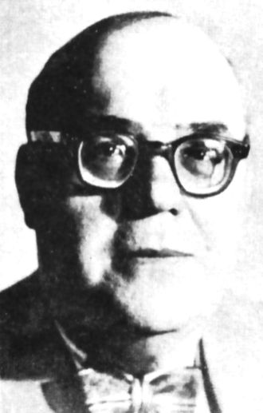
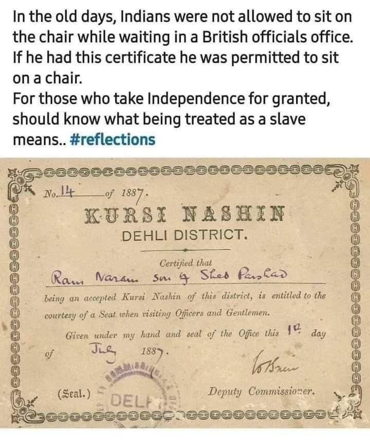

```{r setup, include=FALSE}
knitr::opts_chunk$set(echo = TRUE)
library(blogdown)
#devtools::install_github("mccarthy-m-g/embedr")
library(embedr) # Embed multimedia in HTML files
```

## Ventura Garcia Calderon


```{r, echo=FALSE, out.height="50%", out.width="50%",fig.align='center'}

```


> Ventura García Calderón (1886–1959) was a Peruvian man of letters and
> a diplomat who was at the center of the hispanophone community in
> Paris in the first half of the twentieth century. Known as a proponent
> of Spanish American literature, García Calderón achieved a global
> celebrity for his dramatic, colorful, and ironic short stories. These
> stories, published in both Spanish and French, feature a raw depiction
> of reality, a strong sense of retributive justice, and a sympathy for
> the marginalized people that characterize European Naturalism. García
> Calderón adapted this style to advance his goal of providing European
> readers with an authentic understanding of Peru and Spanish America,
> thus replacing the voyeuristic and patronizing notion of the "exotic"
> inherited from literary romanticism and nineteenth-century travel
> writers.

> The construction of García Calderón's stories was subversive and
> destabilized the widespread notion of Peru held by European critics
> and readers. While international critics during the author's lifetime
> unanimously praised García Calderón's fiction as well as his essays
> that theorize the transformation and renaissance of Spanish language
> and literature by americano writers, scholars since the 1960s have
> largely misunderstood his reformative project.

## Story

We will read Ventura Garcia Calderon's short short story, **The
Lottery Ticket**.


## Themes

-   Marginalized People
-   The Art of Protest!
-   Mob Justice
-   Network Effects, Virality, and the "Wisdom of Crowds"
-   Colour
-   Women and Objectification


## Additional Material

1.  **Kursi Nashin**: A Certificate of Discrimination from British India



2.  Review of **The Lottery Ticket**
    <u><https://caponomics.blogspot.com/2013/05/short-story-review-lottery-ticket-by.html></u>
3.  Ventural Garcia Calderon at **Short Story Magic Tricks**:
    <u><https://shortstorymagictricks.com/2021/07/06/the-lottery-ticket-by-ventura-garcia-calderon/></u>
4.  Goldberg, N. S. (2014). Rereading Ventura García Calderón. Hispania,
    97(2), 220–232. <u><http://www.jstor.org/stable/24368768></u>

## Notes and References

1.  Rene Girard's Mimetic Theory and the Scapegoat:
    <u><https://violenceandreligion.com/mimetic-theory/></u>
1.  Frear, G. L. (1992). René Girard on Mimesis, Scapegoats, and Ethics. The Annual of the Society of Christian Ethics, 12, 115–133.
    <u><http://www.jstor.org/stable/23559770></u>
1. The Network Effects Bible.
    <u><https://www.nfx.com/post/network-effects-bible></u>

## Songs for the Story !!

#### Song for the Black Hero of this story

- Title: What About Me?\
- Band: Moving Pictures\
- Band Location: Sydney, NSW, Australia\
- Album: Days Of Innocence\
- Composed By: Garry Frost, Frances Swan\
- Release Date: January, 1982
- Chart Position:\
  - No.1 (Australia)\
  - No.29 (US Billboard Hot 100)



<br>

#### Song for Cielito

- Title: Bette Davis Eyes
- Artiste: Kim Carnes
- Album: Mistaken Identity
- Composed by: Donna Weiss and Jackie DeShannon
- Year: 1981
- Chart Position:\
    -   No.1 (Australia)
    -   No.1 (US Billboard Hot 100)
    -   No. 10 (UK Singles Charts)



### The "Lottery" Idea in Literature

1.  Shirley Jackson, *The Lottery*.
    <u><https://www.newyorker.com/magazine/1948/06/26/the-lottery></u>
1.  Munshi Premchand. *Lottery*, short story in Hindi.
    <u>[https://en.wikipedia.org/wiki/Lottery\_(short_story)](https://en.wikipedia.org/wiki/Lottery_(short_story)){.uri}</u>
1.  Anton Chekhov, *The Lottery Ticket*.
    <u><https://www.classicshorts.com/stories/lottery.html></u>
1.  Jose Luis Borges. <u>[**The Lottery of
    Babylon.**](Jorge%20Luis%20Borges%20-%20The%20lottery%20of%20Babylon.pdf)</u>


## Writing Prompt

1.  How I went on Strike, myself and me alone
2.  On an ad for Fairness Cream
3.  On a personal encounter with racism/bias
4.  Did I win the Lottery?
5.  Compare Cielito with the Prostitute in Guy de Maupassant's story <u>[**Boule de Suif**](/courses/6-in-short-the-world/modules/20-france-guydemaupassant/)</u>.


