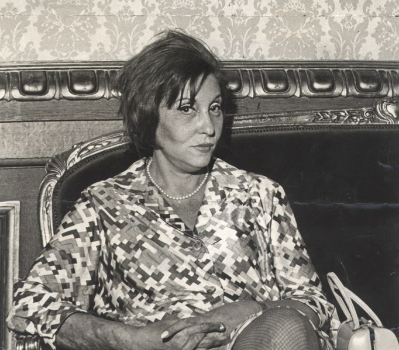

```{r setup, include=FALSE}
knitr::opts_chunk$set(echo = FALSE)
```

## Clarice Lispector

```{r, echo=FALSE, out.height="50%", out.width="50%",fig.align='center'}

```

A Woman, a Jew, born in Ukraine, and one of
Brazil's greatest writers.....Clarice Lispector.

## Story

We will read her story, "Beauty and the Beast, or, The Wound too Great", p. 291 in the **Oxford Anthology of the Brazilian Short Story**, edited by K. David Jackson.



## Themes

-   Beauty and Ugliness
-   Body as Power
-   Ephiphany
-   Where, When, and from Whom do We Learn?
-   Religion as "Lived Life" ([Practical Spirituality](https://estudantedavedanta.net/Practical-Sprituality-Ed1st.pdf))
-   Metaphors
-   Materialism...

## Additional Material

### Notes and References

1.  The New Yorker. *The True Glamour of Clarice Lispector*. <u><https://www.newyorker.com/books/page-turner/the-true-glamour-of-clarice-lispector></u>
2.  Suryakant Tripathi "Nirala". 1923. *Bhikshuk*.
    <u><http://kavitakosh.org></u>

::: {style="text-align: center; font-size: 0.75em;"}

वह आता--

दो टूक कलेजे को करता, पछताता पथ पर आता।

पेट पीठ दोनों मिलकर हैं एक,

चल रहा लकुटिया टेक,

मुट्ठी भर दाने को —भूख मिटाने को

मुँह फटी पुरानी झोली का फैलाता —

दो टूक कलेजे के करता पछताता पथ पर आता।

साथ दो बच्चे भी हैं सदा हाथ फैलाए,

बाएँ से वे मलते हुए पेट को चलते,

और दाहिना दया दृष्टि-पाने की ओर बढ़ाए।

भूख से सूख ओठ जब जाते

दाता-भाग्य विधाता से क्या पाते?

घूँट आँसुओं के पीकर रह जाते।

चाट रहे जूठी पत्तल वे सभी सड़क पर खड़े हुए,

और झपट लेने को उनसे कुत्ते भी हैं अड़े हुए !

**ठहरो ! अहो मेरे हृदय में है अमृत, मैं सींच दूँगा**

**अभिमन्यु जैसे हो सकोगे तुम**

**तुम्हारे दुख मैं अपने हृदय में खींच लूँगा।**

[- Suryakant Tripathi "Nirala"]{style="float:right"}

:::

<br>

## Song for the Story

The roles are the reversed in this song are they? But that is possibly
what we saw in the story...who *is* the beggar?

::: {#fig-phil}
<center>

</center>
Phil Collins - "Another Day in Paradise" (1989)
:::

<br>

Another not un-related song, is this one by [England Dan Seals and John Ford Coley](https://open.spotify.com/artist/01W8kYNqFHyKicPfR0pLwO), especially if you think the lady had a boyfriend earlier.

::: {#fig-englanddan}
<center>

</center>
England Dan Seals and John Ford Coley - "Lady" (1978)
:::


## Writing Prompts

1.  Epiphany: On Growing Older by 5 years in 5 minutes
2.  On How Others seem to Define Us
3.  Explain something using Religious Metaphors (any religion, any
    scripture) !!

